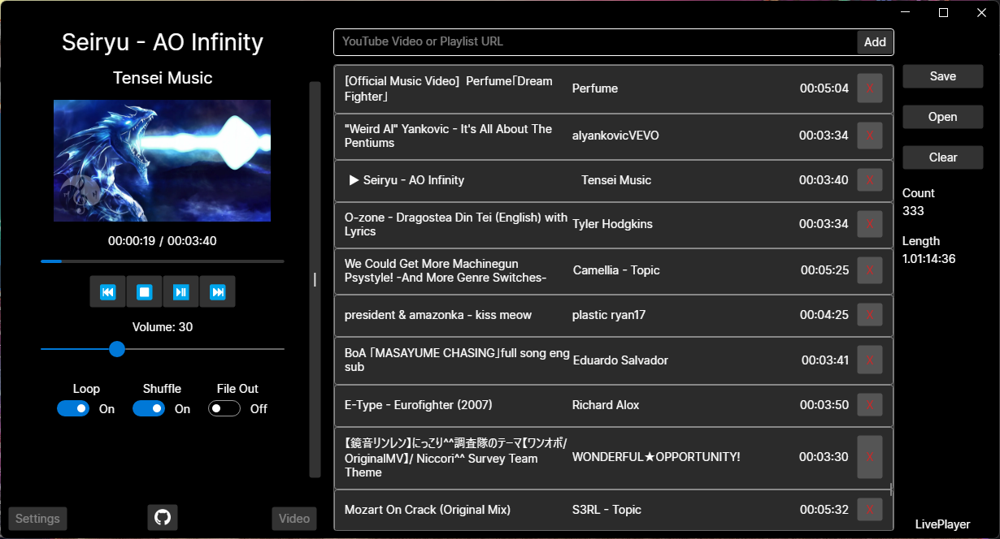
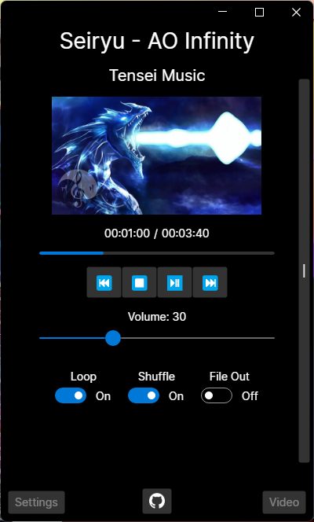

# LivePlayer

A simple YouTube audio player that can output Artist and Title to file and save and load playlists.

Takes a bit to start up the first time.

The latest build is available [here](https://github.com/Sekoree/LivePlayer/releases/latest).
Cross-platform build may follow if demand is there 

---

### Full size mode:

### Small mode:
